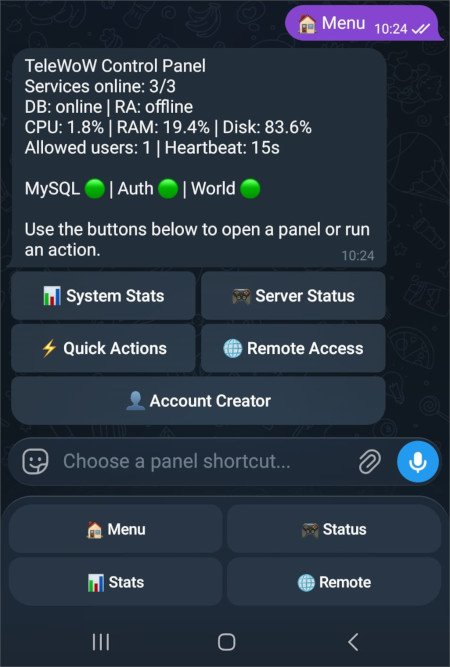
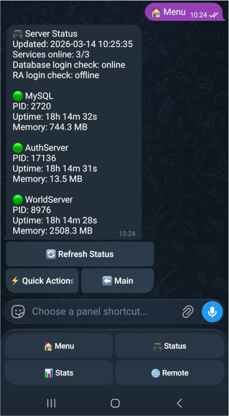
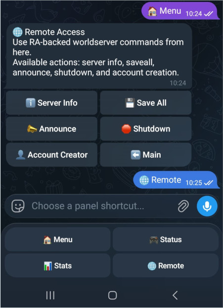
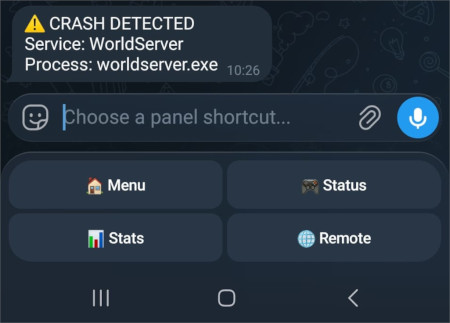

# TeleWoW MoP Controller

TeleWoW is a Windows-first Python Telegram bot for monitoring and controlling a local EmuCoach or TrinityCore Mists of Pandaria repack.

Clone this repository into the repack root directory. The repository folder must be named `tele-wow` and must sit next to `Repack` and `Database`. Relative paths in `.env` are resolved from the `tele-wow` folder, so the default paths intentionally use `../Repack` and `../Database`.


## Table of contents

- [Features](#features)
- [Preview](#preview)
- [Project layout](#project-layout)
- [Requirements](#requirements)
- [Easy install](#easy-install)
- [Manual setup](#manual-setup)
- [Running the bot](#running-the-bot)
- [Buttons](#buttons)
- [Remote Access setup](#remote-access-setup)
- [Operational notes](#operational-notes)
- [License](#license)

## Features

- Telegram bot with inline keyboard control panel
- User ID whitelist protection
- `.env`-driven configuration
- Host stats for CPU, RAM, and disk usage
- Process monitoring for `mysqld.exe`, `authserver.exe`, and `worldserver.exe`
- Crash alerts when a tracked process transitions from running to stopped
- Start, stop, and restart actions for MySQL, AuthServer, and WorldServer
- Remote Access actions for worldserver commands
- In-bot account creation through worldserver RA commands
- Confirmation dialogs for risky actions
- Cleaner dashboard-style main panel with reduced bot message clutter

## Preview
Main dashboard



Server status



Remote Access



Crash alert example



## Project layout

```text
tele-wow/
   bot.py
   config.py
   database.py
   install_bot.bat
   LICENSE
   monitor.py
   ra.py
   requirements.txt
   start_bot.bat
   .env.example
   screenshots/
   TELEGRAM_SETUP.md
```

## Requirements

- Windows host
- Python 3.11+
- A Telegram bot token from BotFather
- One or more Telegram numeric user IDs for the whitelist
- A WoW repack root folder containing `Database` and `Repack`

## Easy install

Recommended for most users:

```bat
install_bot.bat
```

What the installer does:

- Explains that it only installs the bot, not the WoW repack itself
- Checks that `tele-wow` is placed beside `Database` and `Repack`
- Checks for Python 3.11+ and installs it with `winget` if needed
- Creates `.venv`
- Activates `.venv`
- Installs the required Python packages
- Creates `.env` from `.env.example` if `.env` does not already exist

What you still need to do after the installer finishes:

1. Open [TELEGRAM_SETUP.md](TELEGRAM_SETUP.md) and create your Telegram bot.
2. Edit `.env` and fill in your Telegram values.
3. Review the default `../Repack` and `../Database` paths in `.env`.
4. Enable RA in `Repack\worldserver.conf` if you want Remote Access features.
5. Start the bot with `start_bot.bat`.

The installer does not overwrite an existing `.env`, and it reuses an existing `.venv` if one is already present.

## Manual setup

1. Clone this repository into your repack root folder and make sure your structure looks like this:

   ```text
   Database/
   Repack/
   tele-wow/
   ```

2. Open a terminal inside the `tele-wow` folder.
3. Create and activate a virtual environment on Windows:

   ```powershell
   python -m venv .venv
   .\.venv\Scripts\activate
   ```

4. Install dependencies:

   ```powershell
   pip install -r requirements.txt
   ```

5. Copy `.env.example` to `.env`.
6. Keep the `tele-wow` folder in the repack root directory so the default `../Repack` and `../Database` paths stay valid.
7. Follow the Telegram setup guide in [TELEGRAM_SETUP.md](TELEGRAM_SETUP.md) to create your bot, get the token, and find your Telegram user IDs and chat ID.
8. Fill in these values in `.env`:
   - `TELEGRAM_BOT_TOKEN`
   - `TELEGRAM_ALLOWED_USER_IDS`
   - `TELEGRAM_ALERT_CHAT_ID`
   - Server executable and working-directory paths if your installation differs
   - `RA_HOST`, `RA_PORT`, `RA_USERNAME`, `RA_PASSWORD`, and `RA_TIMEOUT_SECONDS` if you want Remote Access features
   - Database connection settings if they differ from the default repack config

The default `.env.example` uses repo-relative paths such as `../Repack/worldserver.exe` and `../Database/_Server/MySQL.bat`, so it stays portable across different install locations.

## Running the bot

```powershell
python bot.py
```

Windows launcher:

```bat
start_bot.bat
```

The bot polls Telegram, schedules a 15-second heartbeat, and sends crash alerts to the configured chat ID.

`start_bot.bat` changes to the repo folder, activates `.venv`, and then runs `python bot.py`. This makes it suitable for double-click launch or for Windows Task Scheduler.

Task Scheduler note:

- Point the task to `start_bot.bat` inside the `tele-wow` folder
- Set `Start in` to the `tele-wow` folder

First run flow:

1. Start the bot with `python bot.py`.
2. Open Telegram and search for the bot username you created in BotFather.
3. Open the bot chat and press `Start`.
4. Send `/whoami` to read your Telegram User ID and Chat ID.
5. Add that User ID to `TELEGRAM_ALLOWED_USER_IDS` in `.env`.
6. Add that Chat ID to `TELEGRAM_ALERT_CHAT_ID` if you want alerts in that chat.
7. Restart the bot.
8. Send `/start` or `/menu` to open the control panel and enable the fixed navigation keyboard.

Before the whitelist is configured, only `/whoami` and `/debugid` are expected to work.

The bot tries to keep one main control-panel message updated instead of sending a new panel message for every action.

After the first authorized `/start` or `/menu`, the bot also enables a fixed reply keyboard with safe shortcuts for `🏠 Menu`, `🎮 Status`, `📊 Stats`, and `🌐 Remote`.

## Buttons

- `📊 System Stats`: CPU, RAM, and disk usage for the configured host path
- `🎮 Server Status`: Running or stopped state for MySQL, AuthServer, and WorldServer
- `⚡ Quick Actions`: Start, stop, and restart shortcuts for the server processes
- `🌐 Remote Access`: Run worldserver RA actions such as server info, saveall, announce, and shutdown
- `👤 Account Creator`: Create a new WoW account through worldserver RA

Fixed reply-keyboard shortcuts:

- `🏠 Menu`: Return to the main dashboard panel
- `🎮 Status`: Open the server status panel
- `📊 Stats`: Open the system stats panel
- `🌐 Remote`: Open the Remote Access panel

Risky actions such as stop, restart, shutdown, and account creation use confirmation steps before the command is executed.

## Remote Access setup

Remote Access (`RA`) is used for worldserver command execution such as announcements, account commands, and server commands.

The current basic process-control features do not require `RA`, but any remote worldserver command feature does.

### Requirements

- `RA` must be enabled in `Repack\worldserver.conf`
- `worldserver.exe` must be running
- You need an existing WoW account for `RA` login
- That account must have a high enough security level for `Ra.MinLevel`

### Required `worldserver.conf` settings

Check the `CONSOLE AND REMOTE ACCESS` section in `Repack\worldserver.conf`.

These settings matter:

```text
Ra.Enable = 1
Ra.IP = "127.0.0.1"
Ra.Port = 3443
Ra.MinLevel = 3
```

Notes:

- `Ra.Enable = 1` enables the remote console
- `Ra.IP = "127.0.0.1"` is recommended when the bot runs on the same machine as the server
- `Ra.MinLevel = 3` means the login account must have security level `3` or higher

### Create the first RA account

`RA` cannot be used until you already have a privileged account.

The first account is usually created from the local `worldserver` console window, not through `RA` itself.

Typical bootstrap flow:

1. Start `worldserver.exe`
2. Open the local worldserver console window
3. Create an account
4. Grant that account a GM or admin level high enough for `RA`
5. Use that account later for `RA` login

Typical commands are:

```text
account create myadmin mypassword
account set gmlevel myadmin 3 -1
```

Important:

- Command syntax can vary slightly between core versions
- If your core uses a different account permission command, use the equivalent command available in your console
- `-1` commonly means all realms on Trinity or SkyFire style cores

### How `RA` is used

Once `RA` is configured, it can be used for commands such as:

- server announcements
- save commands
- shutdown commands
- account creation commands handled by worldserver

### RA values in `.env`

Add these values to `.env`:

```text
RA_HOST=127.0.0.1
RA_PORT=3443
RA_USERNAME=your-ra-account
RA_PASSWORD=your-ra-password
RA_TIMEOUT_SECONDS=10
```

### Using RA in the bot

After the RA values are saved in `.env`:

1. Restart the bot
2. Open the Telegram control panel with `/start` or `/menu`
3. Open `🌐 Remote Access`
4. Use one of the built-in actions:
   - `ℹ Server Info`
   - `💾 Save All`
   - `📣 Announce`
   - `🛑 Shutdown`

For actions that need extra input, the bot will ask you to reply in chat.

Examples:

- `📣 Announce`: send the announcement text in chat
- `🛑 Shutdown`: send the shutdown delay in seconds

You can send `cancel` during an input step to stop the current action.

### Using Account Creator

1. Open the Telegram control panel
2. Press `👤 Account Creator`
3. Press `➕ Create Account`
4. Send the new username in chat
5. Send the new password in chat
6. Confirm the action when the bot asks

The bot will call the worldserver account creation command through `RA`.

`RA` is not used to start or stop Windows processes like `mysqld.exe`, `authserver.exe`, or `worldserver.exe`. Those actions stay in the local process-control layer.

## Operational notes

- MySQL is launched through `Database\_Server\MySQL.bat` by default to match the existing repack tooling.
- AuthServer and WorldServer are launched from the `Repack` folder because their config and data directories are relative.
- Restarting MySQL also restarts dependent server processes in dependency order.
- Unauthorized Telegram users are ignored unless their numeric ID appears in the whitelist.
- Remote console features require RA to be enabled in `Repack\worldserver.conf` by setting `Ra.Enable = 1` in the `CONSOLE AND REMOTE ACCESS` section.

## License

This project is licensed under the MIT License. See [LICENSE](LICENSE).
