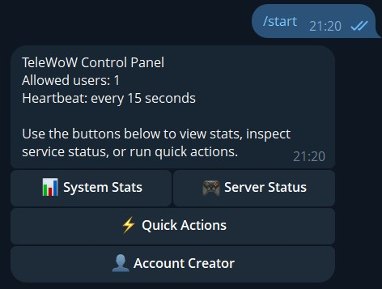

# TeleWoW MoP Controller

TeleWoW is a Windows-first Python Telegram bot for monitoring and controlling a local EmuCoach or TrinityCore Mists of Pandaria repack.

Clone this repository into the repack root directory. The repository folder must be named `tele-wow` and must sit next to `Repack` and `Database`. Relative paths in `.env` are resolved from the `tele-wow` folder, so the default paths intentionally use `../Repack` and `../Database`.

## Features

- Telegram bot with inline keyboard control panel
- User ID whitelist protection
- `.env`-driven configuration
- Host stats for CPU, RAM, and disk usage
- Process monitoring for `mysqld.exe`, `authserver.exe`, and `worldserver.exe`
- Crash alerts when a tracked process transitions from running to stopped
- Start and restart actions for MySQL, AuthServer, and WorldServer

## Preview




## Project layout

```text
tele-wow/
  bot.py
  config.py
  database.py
  monitor.py
  requirements.txt
  .env.example
   screenshots/
   TELEGRAM_SETUP.md
```

## Requirements

- Windows host
- Python 3.11+
- A Telegram bot token from BotFather
- One or more Telegram numeric user IDs for the whitelist
- A WoW repack root folder containing `Database` and `Repack`

## Setup

1. Clone this repository into your repack root folder and make sure your structure looks like this:

   ```text
   Database/
   Repack/
   tele-wow/
   ```

2. Open a terminal inside the `tele-wow` folder.
3. Create and activate a virtual environment on Windows:

   ```powershell
   python -m venv .venv
   .\.venv\Scripts\activate
   ```

4. Install dependencies:

   ```powershell
   pip install -r requirements.txt
   ```

5. Copy `.env.example` to `.env`.
6. Keep the `tele-wow` folder in the repack root directory so the default `../Repack` and `../Database` paths stay valid.
7. Follow the Telegram setup guide in [TELEGRAM_SETUP.md](TELEGRAM_SETUP.md) to create your bot, get the token, and find your Telegram user IDs and chat ID.
8. Fill in these values in `.env`:
   - `TELEGRAM_BOT_TOKEN`
   - `TELEGRAM_ALLOWED_USER_IDS`
   - `TELEGRAM_ALERT_CHAT_ID`
   - Server executable and working-directory paths if your installation differs
   - Database connection settings if they differ from the default repack config

The default `.env.example` uses repo-relative paths such as `../Repack/worldserver.exe` and `../Database/_Server/MySQL.bat`, so it stays portable across different install locations.

## Running the bot

```powershell
python bot.py
```

The bot polls Telegram, schedules a 15-second heartbeat, and sends crash alerts to the configured chat ID.

First run flow:

1. Start the bot with `python bot.py`.
2. Open Telegram and search for the bot username you created in BotFather.
3. Open the bot chat and press `Start`.
4. Send `/whoami` to read your Telegram User ID and Chat ID.
5. Add that User ID to `TELEGRAM_ALLOWED_USER_IDS` in `.env`.
6. Add that Chat ID to `TELEGRAM_ALERT_CHAT_ID` if you want alerts in that chat.
7. Restart the bot.
8. Send `/start` or `/menu` to open the button-based control panel.

Before the whitelist is configured, only `/whoami` and `/debugid` are expected to work.

## Buttons

- `📊 System Stats`: CPU, RAM, and disk usage for the configured host path
- `🎮 Server Status`: Running or stopped state for MySQL, AuthServer, and WorldServer
- `⚡ Quick Actions`: Start and restart shortcuts
- `👤 Account Creator`: Currently unavailable

## Operational notes

- MySQL is launched through `Database\_Server\MySQL.bat` by default to match the existing repack tooling.
- AuthServer and WorldServer are launched from the `Repack` folder because their config and data directories are relative.
- Restarting MySQL also restarts dependent server processes in dependency order.
- Unauthorized Telegram users are ignored unless their numeric ID appears in the whitelist.
